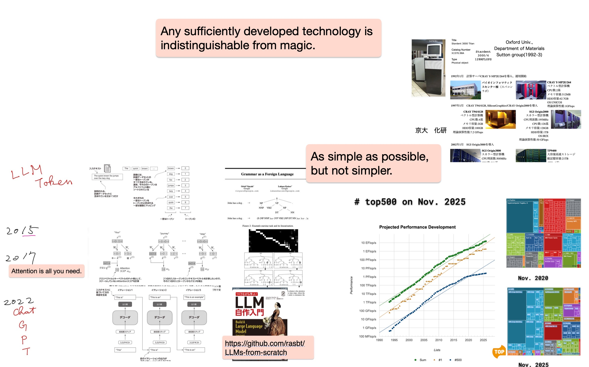
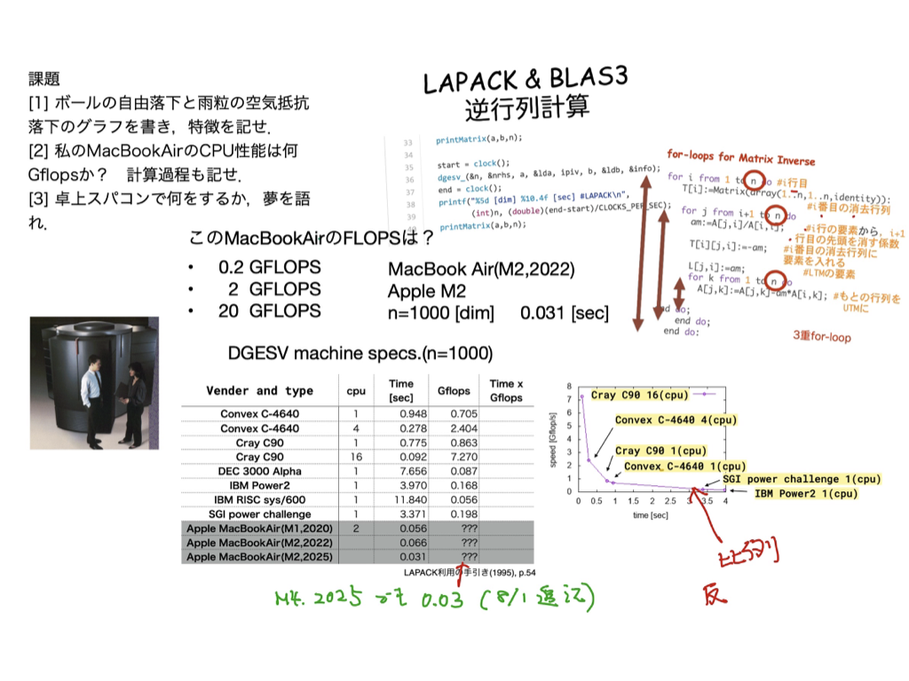

#+OPTIONS: ^:{}
#+STARTUP: indent nolineimages overview num
#+TITLE: 卓上スパコン(西谷) / 情報工学概論
#+AUTHOR: Shigeto R. Nishitani
#+EMAIL:     (concat "shigeto_nishitani@mac.com")
#+LANGUAGE:  jp
#+OPTIONS:   H:4 toc:t num:2
#+HTML_HEAD: <link rel="stylesheet" type="text/css" href="style.css" />
#+MACRO: dummy_link @@html:<a href="#">$1</a>@@

# for style.css, never move from here
[[../c0_mk_stack_dir/readme.html][prev_button]]
[[../intro_info_26s.html][up_button]]
[[../c2_solar_system/readme.html][next_button]]
# for a real link rewrite usual [[\url][]]

* outline
| 

* 課題とGFlop/s計算資料
** 課題
1. 玉の自由落下と雨粒の空気抵抗落下のグラフを手書きし，特徴を記せ．
1. 私のMacBook AirのCPU性能は何GFlop/sか？　計算過程も記せ．
1. 卓上スパコンで何をするか，夢を語れ．
** GFlop/s計算資料
| 
* 課題提出用紙
- [[file:./quiz_sheet.pages.pdf]]
