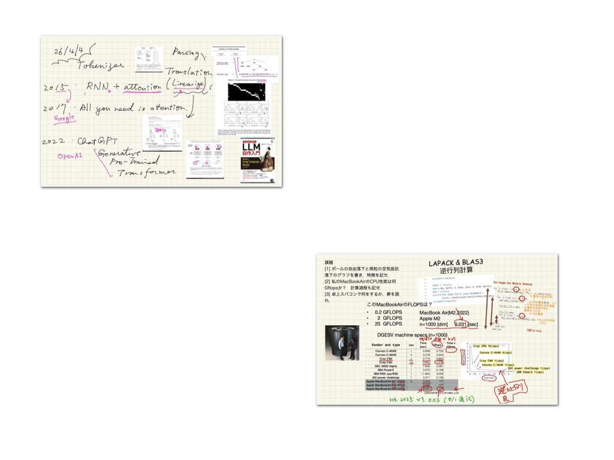

#+OPTIONS: ^:{}
#+STARTUP: indent nolineimages overview num
#+TITLE: 卓上スパコン(西谷) / 情報工学概論
#+AUTHOR: Shigeto R. Nishitani
#+EMAIL:     (concat "shigeto_nishitani@mac.com")
#+LANGUAGE:  jp
#+OPTIONS:   H:4 toc:t num:2
#+HTML_HEAD: <link rel="stylesheet" type="text/css" href="style.css" />
#+MACRO: dummy_link @@html:<a href="#">$1</a>@@

# for style.css, never move from here
[[../c3_linear_algebra_core/readme.html][prev_button]]
[[../intro_info_26s.html][up_button]]
[[../c2_solar_system/readme.html][next_button]]
# for a real link rewrite usual [[\url][]]

| 
