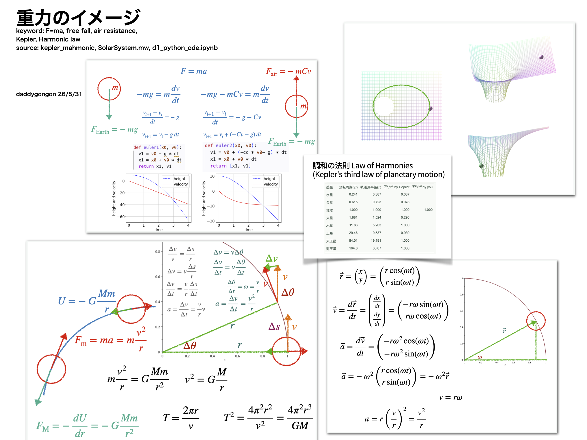

#+OPTIONS: ^:{}
#+STARTUP: indent nolineimages overview num
#+TITLE: ケプラーの法則イメージ / 卓上スパコン(西谷)
#+AUTHOR: Shigeto R. Nishitani
#+EMAIL:     (concat "shigeto_nishitani@mac.com")
#+LANGUAGE:  jp
#+OPTIONS:   H:4 toc:t num:2
#+HTML_HEAD: <link rel="stylesheet" type="text/css" href="style_w_link_button_one_column.css" />
#+MACRO: dummy_link @@html:<a href="#">$1</a>@@

# for style.css, never move from here
[[../c1_outline/readme.html][prev_button]]
[[../intro_info_26s.html][up_button]]
[[../c3_linear_algebra_core/readme.html][next_button]]
# for a real link rewrite usual [[\url][]]

* ケプラーの法則のイメージ(重力場)
|                        |

* 調和の法則(Kepler's third law: Law of Harmonies)

| 惑星   | 公転周期($T$) | 軌道長半径($r$) |  $T^2/r^3$ | $T^2/r^3$ |
|        |               |                 | by Copilot | by you    |
| 水星   |         0.241 |           0.387 |      0.037 |           |
| 金星   |         0.615 |           0.723 |      0.078 |           |
| 地球   |         1.000 |           1.000 |      1.000 | 1.000     |
| 火星   |         1.881 |           1.524 |      0.296 |           |
| 木星   |         11.86 |           5.203 |      1.000 |           |
| 土星   |         29.46 |           9.537 |      0.930 |           |
| 天王星 |         84.01 |          19.191 |      1.000 |           |
| 海王星 |         164.8 |           30.07 |      1.000 |           |

* file links
- [[file:./SolarSystem.mw][./SolarSystem.mw]]
- [[file:./d1_python_ode.ipynb][./d1_python_ode.ipynb]]
- [[file:./d1_python_ode.pdf][./d1_python_ode.pdf]]
- [[file:./kepler_harmonic.key][./Kepler_Harmonices_Mundi.key]]
- [[https://ist.ksc.kwansei.ac.jp/~nishitani/Lectures/2026/model_phys/d2_Kepler_0414/d2_Kepler_0414.html][model_phys]](symlink)

  
