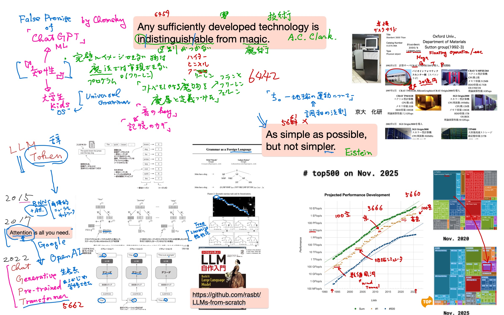
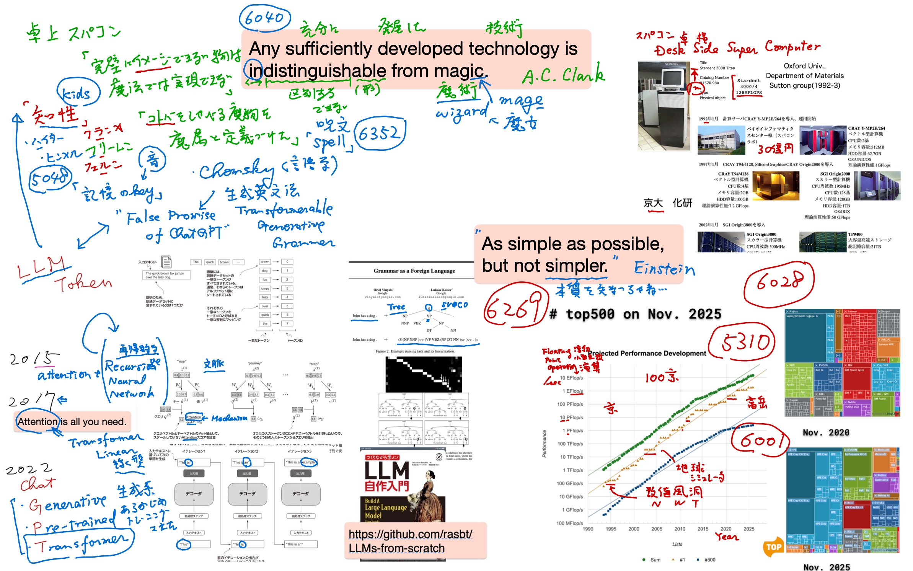

#+OPTIONS: ^:{}
#+STARTUP: indent nolineimages overview num
#+TITLE: 板書，動画置き場リンク
#+AUTHOR: Shigeto R. Nishitani
#+EMAIL:     (concat "shigeto_nishitani@mac.com")
#+LANGUAGE:  jp
#+OPTIONS:   H:4 toc:t num:2
#+HTML_HEAD: <link rel="stylesheet" type="text/css" href="style_w_link_button.css" />
#+MACRO: dummy_link @@html:<a href="#">$1</a>@@

# for style.css, never move from here
[[../c1_outline/readme.html][prev_button]]
[[../intro_info_26s.html][up_button]]
[[../c2_solar_system/readme.html][next_button]]
# for a real link rewrite usual [[\url][]]

* 板書
** 6/15
| 
** 6/16
| 

* link
- [[https://kwanseio365-my.sharepoint.com/:f:/g/personal/cru32369_nuc_kwansei_ac_jp/IgA3TLpuub3uRqPAJ2cfi-6LAXFojn7DWprL2oDFVziiNYA?e=yXXCoZ][講義動画置き場]]

